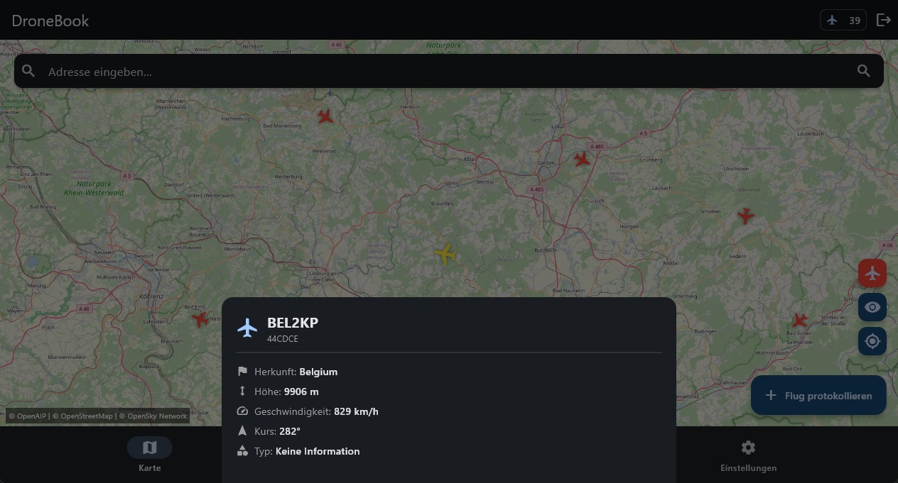
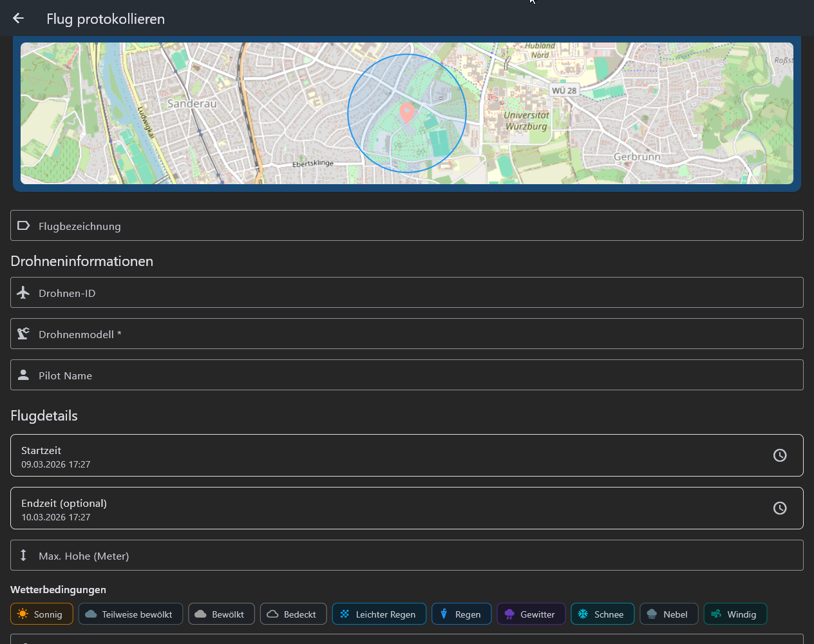
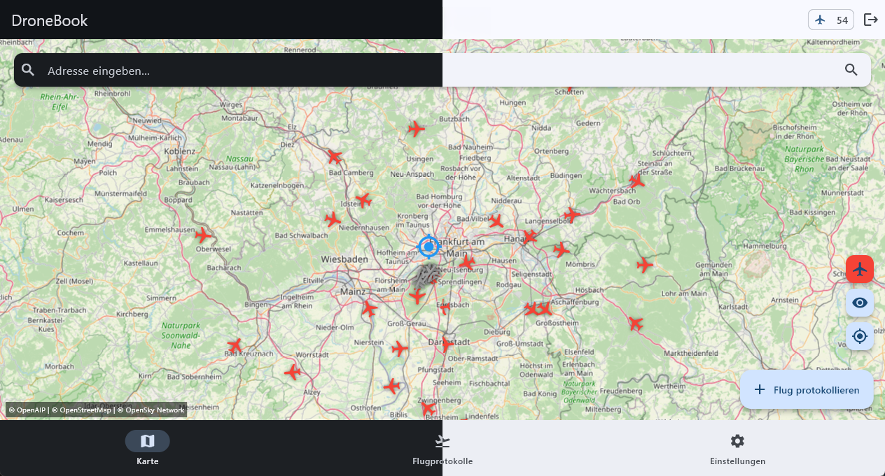

#  DroneBook

A Flutter app for drone pilots to plan and document flights with map-based awareness, no-fly overlays, and Supabase-backed flight logs.

## Features

- **Interactive Map** - OpenStreetMap view with live location support
- **No-Fly Overlays** - Visual no-fly zone tiles on top of the map
- **Flight Logging** - Track aircraft, notes, and operational flight details
- **Flight History** - Review saved logs in a clean list view
- **Supabase Auth + Data** - User auth and cloud persistence with row-level security
- **Multilingual UI** - Built-in localization support (currently English and German)

## Screenshots

| Screen | Preview | Description |
| --- | --- | --- |
| Flight Info |  | Shows detailed flight planning and operational info for a selected mission. |
| Flight Log |  | Captures and reviews flight entries, notes, and aircraft-related log details. |
| Themes |  | Theme is based on system preference. |

## Internationalization

DroneBook includes Flutter localization (i18n/l10n) support out of the box.

- **Supported languages** - English (`en`) and German (`de`)
- **ARB files** - `lib/l10n/app_en.arb` and `lib/l10n/app_de.arb`
- **Generated localizations** - `app_localizations*.dart` files in `lib/l10n/`

### Add a New Language

1. Create a new ARB file in `lib/l10n/` (for example `app_fr.arb`)
2. Add all translated keys matching the existing ARB structure
3. Regenerate localizations:

```bash
flutter gen-l10n
```

4. Restart the app and verify the new locale appears correctly

## Prerequisites

- Flutter SDK `3.11.0` or newer
- A Supabase project
- Android Studio/Xcode (depending on your target platform)

## Setup

### 1. Create a Supabase Project

1. Create a project at [supabase.com](https://supabase.com)
2. Open **Project Settings -> API**
3. Copy:
	- `SUPABASE_URL`
	- `SUPABASE_ANON_KEY`

### 2. Configure Environment Variables

Create a local env file from the example:

```bash
cp .env.local.example .env.local
```

Then update `.env.local`:

```env
SUPABASE_URL=https://your-project-ref.supabase.co
SUPABASE_ANON_KEY=your-supabase-anon-key
```

Configuration notes:

- `SUPABASE_URL` - Your Supabase project URL (required)
- `SUPABASE_ANON_KEY` - Your Supabase anon/public key (required)

Security note:

- Keep `.env.local` private and never commit real credentials
- This repository is configured to ignore `.env` files

### 3. Install Dependencies

```bash
flutter pub get
```

### 4. Run the App

```bash
flutter run
```

## Supabase (Optional Local Dev)

If you use the local Supabase CLI workflow in `supabase/`:

```bash
pnpm install
pnpm supabase start
```

When running locally, point `SUPABASE_URL` to your local instance (for example `http://127.0.0.1:54321`).

## iOS Permissions

Ensure these keys exist in `ios/Runner/Info.plist`:

```xml
<key>NSLocationWhenInUseUsageDescription</key>
<string>This app needs access to your location to show your position on the map</string>
<key>NSLocationAlwaysUsageDescription</key>
<string>This app needs access to your location to track flights</string>
```